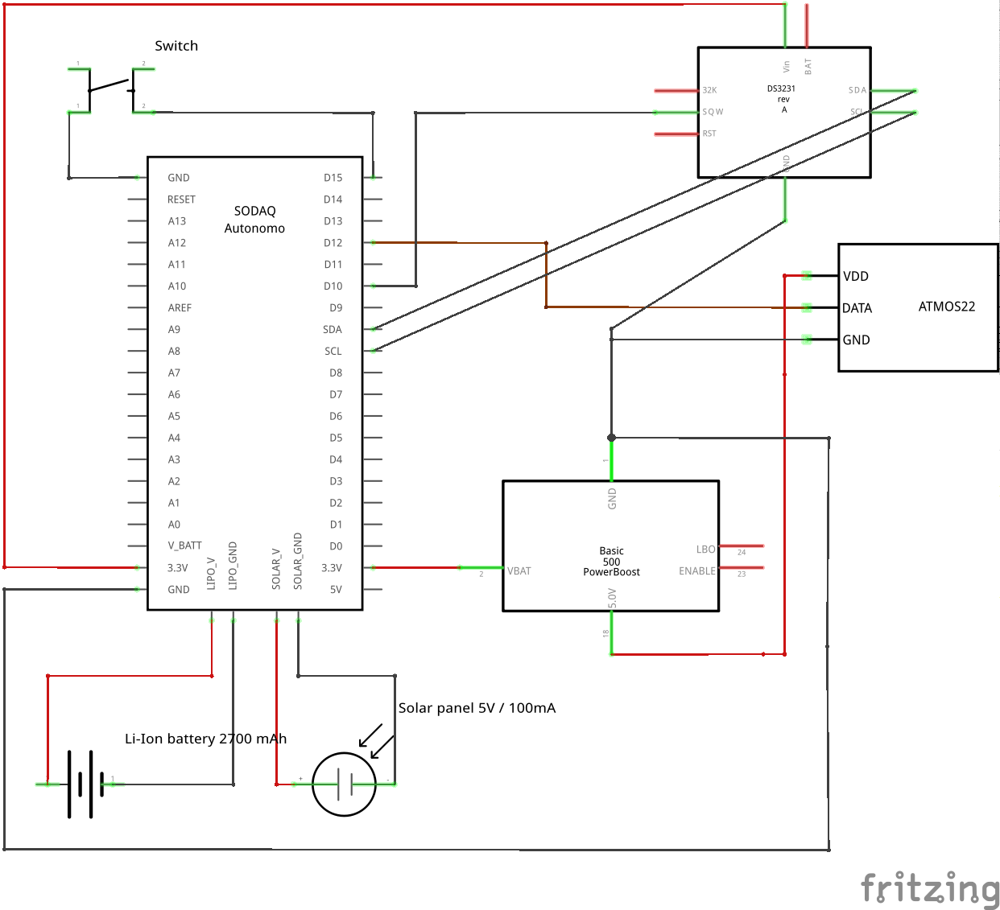
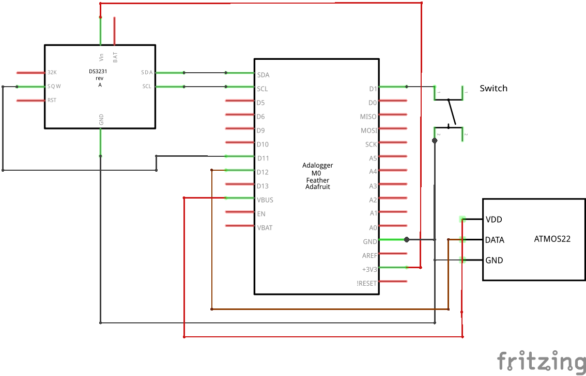

# Wiring diagrams

## SODAQ Autonomo

## Adafruit Feather M0 Adalogger

The diagram does not include the [solar power manager](https://wiki.dfrobot.com/Solar_Power_Manager_5V_SKU__DFR0559) (DFROBOT DFR0559) providing the 5V USB power source.

## Fritzing files

The Fritzing parts for the solar panel and SODAQ Autonomo were [obtained here](https://github.com/GabrielNotman/SODAQ_Fritzing) and further modified. The Adafruit parts were [obtained from this page](https://github.com/adafruit/Fritzing-Library). The Li-Ion battery was modified from a battery part from the Fritzing core library. License: CC BY-SA 3.0.
